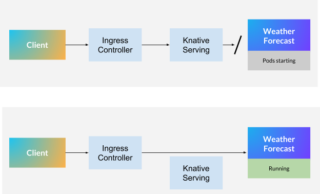
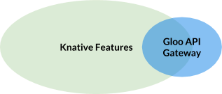

[编者按]
> 之前有社区成员询问是不是想尝试Knative，必须要安装Istio才行，今天就告诉大家一种Istio的替代方案，使用Solo.io公司研发的Gloo来替代Istio来使用Knative。

> *在Knative中，Istio的主要作用是作为一个Ingress技术。Gloo现在加入Istio作为Knative的集成和支持Ingress。有关快速演示demo，请参阅文章末尾。*

简而言之，[Knative的存在](https://github.com/knative/docs)是为了提供在[Kubernetes](https://kubernetes.io/)上构建和服务工作负载的方法。Knative的一个显著特性是它的serverless特性:它将工作负载的执行与事件关联起来，而只在此类事件发生时消耗计算能力（事件驱动）。

Knative是一项最初在谷歌创建，现在已与Pivotal、Red Hat、SAP、IBM等许多公司联合开发的开放源码协作技术。

## 使用Knative服务处理请求

让我们简要了解一下Knative如何处理请求，以及它与“纯”Kubernetes的比较。

Kubernetes上的*传统*工作负载，比如web应用程序，需要一个运行的Pod和一个Ingress，以允许流量从其他集群流到集群。

现在，通过Knative的视角，让我们考虑下面的示例:有如下一个场景，客户端希望从一个在Knative平台上注册但不一定立即运行的应用程序中检索天气预报信息。使用Knative术语，有一个服务可以创建必要的配置和路由，以便在调用天气预报应用程序时运行它。在Knative上下文中，应用程序包括：

* [Knative Service](https://github.com/knative/serving/blob/master/docs/spec/spec.md#service)（不要与Kubernetes Service对象混淆）

* [Knative Route](https://github.com/knative/serving/blob/master/docs/spec/spec.md#route)

* [Knative Configuration](https://github.com/knative/serving/blob/master/docs/spec/spec.md#configuration)

* 一个或多个[Knative Revision](https://github.com/knative/serving/blob/master/docs/spec/spec.md#revision)，运行时，Revision会变成Kubernetes Pod。


深入到流量管理部分，Knative service有一个名为[Activator](https://github.com/knative/serving/tree/master/pkg/activator)的组件，它负责报告某个工作负载需要运行相应数量的pod来处理请求。

这种体系结构的美妙之处在于，如果负责运行应用程序的Pod没有运行，那么请求将被搁置，直到流量可以路由到一个或多个pod为止。这优化了资源利用率。

如果您想知道，还有一些特性允许您预热应用程序，这样就不会阻塞任何请求。这使您能够基于是否始终保持Pod运行做出明智的决策。



如前所述，一旦有一个修订（一个或多个Pod）来处理请求，流量就可以从Ingress网关流到您的修订。Knative Serving将继续收到请求的通知，以便确定是否需要对服务于修订的Pod进行伸缩。这真的太棒了!

## Istio的必要性

请求可能需要路由到相同配置的不同版本(请阅读工作负载规范)，特别是在同时运行同一应用程序的不同版本的情况下。为了做到这一点，Knative需要一个可以执行以下功能的Ingress控制器：

* 流量分流

* 重试

* TLS终止

* 基于Header路由

* 追加Header

Solo.io拥抱[Istio](https://istio.io/zh/)。我们已经投资构建了一个名为[SuperGloo](https://github.com/solo-io/supergloo)的服务网格编排器和管理平台，这可能是开始使用Istio的最简单方法。就我个人而言，我也很喜欢Istio。在红帽的时候，我参与了这个项目的[正式启动](https://blog.openshift.com/red-hat-istio-launch/)，并[写下](https://www.infoworld.com/article/3273547/the-rise-of-the-istio-service-mesh.html)了为什么Istio如此受欢迎。

但如果我诚实地评价Istio在Knative上的角色，我的感觉是：


Istio提供了一组令人惊讶的特性，但是Knative只使用了其中的一些。作为参考，Istio目前有48个CRD （CustomResourceDefinition对象），其中只有一个主要由Knative（VirtualService）使用。

现在，如果您的组织也愿意采用服务网格技术，并且Istio是您的选择，那么这种痛苦肯定会减少。为此，您必须熟悉或已经熟悉Istio的工作原理。现在对于许多用户来说，增加的复杂性可能不值得。

## Gloo——下一代通用API网关，作为网关服务。

Gloo是下一代API网关，它既满足Knative的需求，又不会带来成熟服务网格技术(Istio就是这种情况)的不必要包袱。



[Gloo](https://gloo.solo.io/)建立在Envoy之上，[是Knative第一个官方的Istio替代品](https://knative.dev/docs/install/knative-with-gloo/)。

但这在现实中意味着什么呢?当我们决定对这个解决方案投入精力时，我们的主要目标之一就是解决方案的可持续性。当一个新版本出现时，一起工作的项目突然停止工作，这肯定会令人沮丧，我们的集成工作主要集中在三个方面:易用性、实现和持续集成。

## 易用性

[Solo.io](https://www.solo.io/)作为一家公司的一个关键任务是为了弥合先进的开源技术与使用这种技术的企业和用户之间的差距。在这种程度上，我们在[使用Gloo时改进了Knative本身的安装](https://knative.dev/docs/install/knative-with-gloo/)。整个社区可以立即受益于一种更简单的实验和生产方式。

流行的`glooctl`命令现在包含一个Knative选项，该选项[不仅安装Gloo网关本身而且还将安装Knative](https://gloo.solo.io/installation/#2c-install-the-gloo-knative-cluster-ingress-to-your-kubernetes-cluster-using-glooctl)（！！！）。在安装过程中，Knative配置了[Gloo](https://gloo.solo.io/)作为集群Ingress网关，它使用一个命令：

```shell
$ glooctl install knative
```

## 实现

虽然这是一个显而易见的问题，但我们创建了必要的控制和监视，以便[Gloo](https://gloo.solo.io/)能够在Istio Ingress运行时在相同或更好的容量水平上运行和报告。大部分工作都是在Gloo上完成的。在技术层面，Gloo得到了扩展，包括基于Knative ClusterIngress CRD读取和应用配置的能力。

## 持续集成

我们在[Knative](https://github.com/knative/serving/pull/3087)的CI测试流水线中实现并引入了特定的Gloo测试，这意味着如果Knative中的一个更改破坏了与Gloo的集成，反之亦然，那么社区将得到通知并根据情况采取相应的行动。这为任何正在寻找Knative上的Istio的替代方案的人提供了必要的平静，在撰写本文时，Knative是惟一的替代方案。

## 立刻行动吧！

如果您能够访问Kubernetes集群，只需[下载](https://github.com/solo-io/gloo/releases)最适合您的操作系统的`glooctl`版本，然后立即开始您的Knative（和[Gloo](https://gloo.solo.io/)）之旅。我们最近也增加了对Windows的支持。要获得更多帮助，请查看我们的Knative特定[文档](https://gloo.solo.io/installation/#2c-install-the-gloo-knative-cluster-ingress-to-your-kubernetes-cluster-using-glooctl)并加入我们的[Slack](http://slack.solo.io/)。

Gloo可以做的不仅仅是基本的Ingress路由。Gloo被设计为下一代API网关，能够理解功能级别的调用(HTTP1、HTTP2、gRPC、REST/OpenAPISpec、SOAP、WebSockets、Lambda/Cloud函数)，并能够帮助您从单一功能到微服务和serverless的演进。参加我们的[网络研讨会](https://www.solo.io/)，我们将讨论如何渐进地、安全地发展您的应用程序体系结构，以利用新功能来满足您的业务需求，而不必对您的单体应用进行危险的更改。

## 观看介绍视频

<https://www.youtube.com/watch?v=_e61MB2Afvs>