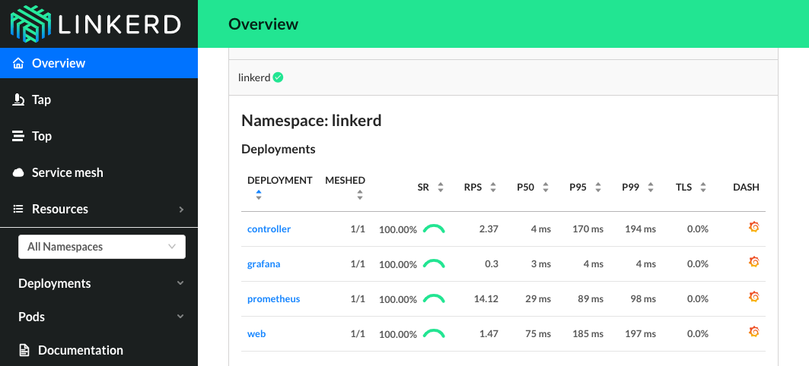

## 基于Kubernetes的服务网格

[编者按]

> 文章介绍了基于Kubernetes的服务网格，简要的说明了服务网格的作用，sidecar的作用以及服务网格两个重要实现：Istio与Linkerd的起源和结构，鼓励大家上手尝试。

[ALEN KOMLJEN](https://akomljen.com/author/alen/) 2018年1月28日，阅读时间4分钟

几个月前我同事问起我对于如何集成[Linkerd](https://linkerd.io/)到我们新的运行在[Kubernetes](https://akomljen.com/tag/kubernetes/)应用里面有什么想法。我的第一反应是，嘿，难道Kubernetes服务和[ingress](https://akomljen.com/tag/ingress/)还不够么？你能够基于它们做很多事情了。再考虑服务网格的话似乎有点过度设计。通常你有一些API只对内部网络开放，然而对于现在流行的应用来说，这并不够。API通常暴露在互联网上并且也有非常大的流量。你需要在流量上有更多的控制。甚至你还需要做API版本化，做金丝雀部署，观察并记录每一个请求。这就引入了服务网格。无论你用[Linkerd](https://linkerd.io/)或是[Istio](https://istio.io/)，原理上都是一样的。

### 为什么要用服务网格？

服务网格并不是和Kubernetes一起出现。然而，因为有Kubernetes，服务网格更容易被引入到你的环境中。有两个逻辑组件组成了服务网格。我们已经有了pod用于承载各个容器。Sidecar是另一个绝好的例子用于扩展和加强pod里面的主要容器。在服务网格语境里，sidecar是服务代理或者数据平面。

> 服务网格是云原生的核心组件

为了更好的理解服务网格，你需要理解代理和反向代理这两个术语。**代理**，用一句话说，用于接收流量并中转到其它地方。**反向代理**，从各个地方接收流量并转交给各个服务。这种情况下，所有的客户只和一个代理实例交流。把数据平面想象为一个反向代理。Ingress也是Kubernetes里面用于暴露服务的反向代理。Ingress可以中止SSL，提供基于名称的路由，并且它主要就干这个事情。对于Kubernetes服务也是一样。如果你需要更复杂的路由该怎么做呢？

下面列举一些其它服务网格可以做的事情：

- 负载均衡
- 精细流量策略
- 服务发现
- 服务监控
- 追踪
- 路由
- 服务与服务的安全通信

不仅有sidecar代理，所有的服务网格解决方案还包含控制器，用于定义sidecar容器应该如何工作。服务网格的控制平面是一个集中的、管理所有的服务网格和服务代理的地方。这个控制面板记录网络信息，所以它也是一个网络监控工具。

所以，为什么要用服务网格？答案很简单，你可以做上面的任何事情并且不需要修改代码。它能够节省时间与金钱。不仅如此，更重要的是，你不能跳过测试，因为它对于初学者太复杂。甚至你可以通过[Istio故障注入](https://istio.io/docs/concepts/traffic-management/#fault-injection)模拟不同的场景，来测试系统对于失败的反应。

### Linkerd2与Istio

在一开始，我提到过两个在Kubernetes上创建服务网格的著名的解决方案。未来也许还会有其它更多的解决方案。每一个产品都试图用自己的方式解决问题，相互之间肯定会有重复的地方。

[Buoyant](https://buoyant.io/)，这家公司创造了Linkerd，同时还创造了Conduit服务。近期，Conduit被合并到Linkerd项目，称作**Linkerd2**。buoyant团队把Linkerd服务网格变成了一个更加通用的解决方案。它用Java编写，这意味着它很重。每一个pod会有一个或更多的容器，一个sidecar。[Linkerd2](https://linkerd.io/2/overview/)设计应用于Kubernetes。它的开发语言包含Go-控制平面，和Rust-一个原生的服务代理，超级轻量、快速并安全。你可以定义重试和超时，定义编排规则，以及加密（TLS），同时还支持根据策略通过或拒绝请求。不仅如此，它还有一个很漂亮的控制台：

如果你喜欢控制台的话也可以用`linkerd`CLI。

Linkerd的[入门向导](https://linkerd.io/2/getting-started/)非常不错，你可以试一试。如果想学习更多，可以看看它的[官方文档](https://linkerd.io/docs/)。

**Istio**当前支持Kubernetes和[Nomad](https://www.nomadproject.io/)，将来会添加更多的功能。Istio是一个多平台解决方案。它可以做微服务流量管理，策略应用以及聚合采样信息。Istio也是Go语言编写的轻量应用，但不同于Linkerd2，它使用[Envoy](https://www.envoyproxy.io/)来做服务代理。下图说明Istio中各个部分是如何组合工作的:

我喜欢Istio的其中一点是[sidecar自动注入](https://istio.io/docs/setup/kubernetes/sidecar-injection.html#automatic-sidecar-injection)，前提是你已经使用[Helm](https://akomljen.com/package-kubernetes-applications-with-helm/)来发布应用，这样的话就不需要手工把sidecar注入到kubernetes的配置文件里面。

在Kubernetes上安装Istio请参考[这篇快速指南](https://istio.io/docs/setup/kubernetes/quick-start.html)。其它关于Istio的信息，请参考它的[官方文档](https://istio.io/docs/)。

这两个产品都是开源的。无论哪一个服务网格方式适合你，它们两个都很容易上手实验。不超过5分钟就可以把它跑起来。我鼓励你都去试一试然后再做决定。目前阶段Istio实现的功能比Linkerd2多了很多，并且也是一个稳定版本。

### 总结

我希望这篇文章很好的介绍了服务网格。这篇文章并不是Linkerd2和Istio之间的比较。我列举了一些功能点，这样你可以了解一下服务网格给Kubernetes带来了什么。请继续关注我们的后续文章。